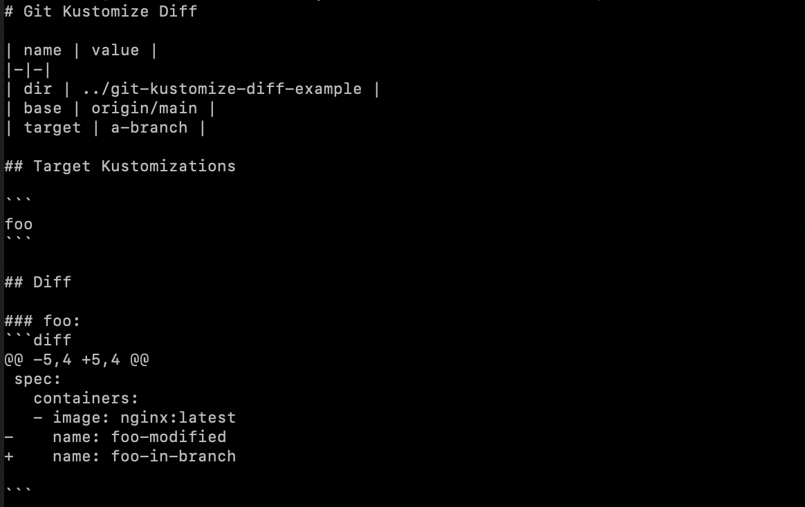

# git-kustomize-diff

[![Go Reference][godoc-image]][godoc-link]
[![Coverage Status][cov-image]][cov-link]

Check diff of your kustomize directory.



## Prerequisites

- [golangci-lint v1.42.1](https://github.com/golangci/golangci-lint)

## Installation

```bash
$ go install -u github.com/dtaniwaki/git-kustomize-diff
```

Or, download the binary from [GitHub Releases][release] and drop it in your `$PATH`.

## Usage

```bash
$ git-kustomize-diff run
```

## Contributing

1. Fork it
2. Create your feature branch (`git checkout -b my-new-feature`)
3. Commit your changes (`git commit -am 'Add some feature'`)
4. Push to the branch (`git push origin my-new-feature`)
5. Create new [Pull Request](../../pull/new/master)

## Copyright

Copyright (c) 2021 Daisuke Taniwaki. See [LICENSE](LICENSE) for details.


[godoc-image]: https://pkg.go.dev/badge/github.com/dtaniwaki/git-kustomize-diff.svg
[godoc-link]: https://pkg.go.dev/github.com/dtaniwaki/git-kustomize-diff
[cov-image]:   https://coveralls.io/repos/github/dtaniwaki/git-kustomize-diff/badge.svg?branch=main
[cov-link]:    https://coveralls.io/github/dtaniwaki/git-kustomize-diff?branch=main

